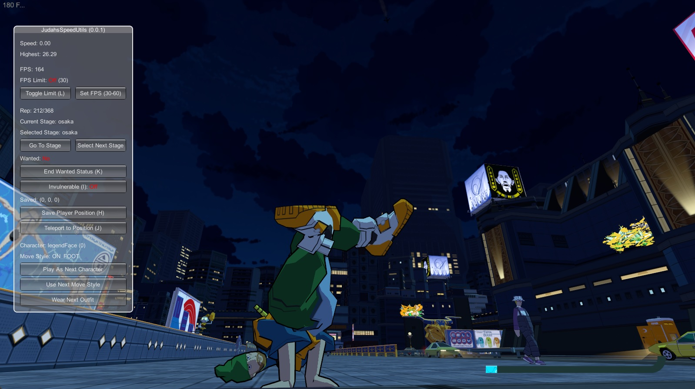

# Judah's Speed Utils

A speedrun helper mod for Bomb Rush Cyberfunk.

## Features

#### Version 0.0.1

- FPS Counter and Limiter (30, 60, Uncapped)
- REP Counter. Shows current REP and challenge requirement (or the stage maximum if no active challenge)
- Stage Selector (allows any playable stage to be selected; does not reset progress)
- Wanted Status Remover
- Invulnerability
- Position Saving and Teleporting
- Character Swapper
- Move Style Swapper
- Outfit Swapper

## Installation

- Install [BepInEx](https://docs.bepinex.dev/articles/user_guide/installation/index.html#installing-bepinex-1)
- Download `JudahsSpeedUtils.dll` from [GitHub](https://github.com/judah-caruso/SpeedUtils/releases)
- Place `JudahsSpeedUtils.dll` into `[BRCF Install Dir]\BepInEx\plugins`
- Press `'` in-game to toggle the menu

## Building from source
- Clone this repository
- Copy `[BRCF Install Dir]\Bomb Rush Cyberfunk_Data\Managed\Assembly-CSharp.dll` to the root of the repository
- Run `dotnet build`
- Copy `bin\debug\net46\JudahsSpeedUtils.dll` to `[BRCF Install Dir]\BepInEx\plugins`