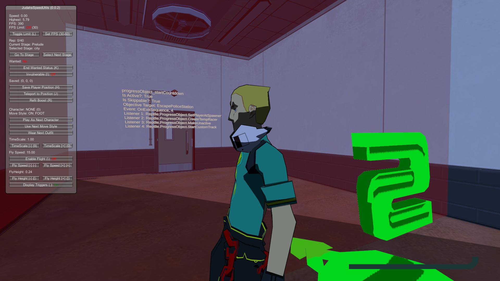

# Judah's Speed Utils

A speedrun helper mod for Bomb Rush Cyberfunk.

## Features

#### Version 0.0.3

- Ability to view triggers
- Ability to see what some triggers will do

## Installation

- Download [BepInEx 5.4.21](https://github.com/BepInEx/BepInEx/releases/tag/v5.4.21) and extract it to your BRCF install directory.
- Open Bomb Rush Cyberfunk so BepInEx will run its setup, then close the game once you're at the main menu.
- Download `JudahsSpeedUtils.dll` from [GitHub](https://github.com/judah-caruso/SpeedUtils/releases) and place it into `[BRCF Install Dir]\BepInEx\plugins` 
- Press `'` (single quote) in-game to toggle the menu

## Building from source
- Clone this repository
- Copy `[BRCF Install Dir]\Bomb Rush Cyberfunk_Data\Managed\Assembly-CSharp.dll` to the root of the repository
- Copy `[BRCF Install Dir]\Bomb Rush Cyberfunk_Data\Managed\Unity.TextMeshPro.dll` to the root of the repository
- Copy `[BRCF Install Dir]\Bomb Rush Cyberfunk_Data\Managed\UnityEngine.UI.dll` to the root of the repository
- Run `dotnet build`
- Copy `bin\debug\net46\JudahsSpeedUtils.dll` to `[BRCF Install Dir]\BepInEx\plugins`